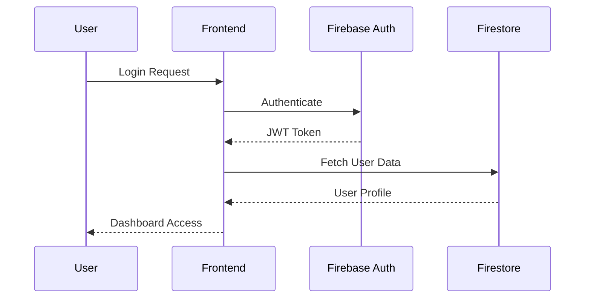

# 🚀 StreakedIn - Professional Productivity Tracker

<div align="center">


*Transform your productivity with intelligent goal tracking, AI-powered insights, and beautiful analytics*

[🌐 Live Demo](https://streakedin.vercel.app) • [📖 Documentation](https://docs.streakedin.com) • [🐛 Report Bug](https://github.com/Anish-2005/StreakedIn/issues) • [✨ Request Feature](https://github.com/Anish-2005/StreakedIn/issues)

---

</div>

## 📸 Screenshots

<div align="center">

### 🖥️ Desktop Dashboard


### 📱 Mobile Experience


### 🎯 Goal Tracking Interface


</div>

---

## ✨ Features

<div align="center">

### 🎯 Core Functionality

| Feature | Description | Status |
|---------|-------------|--------|
| **📊 Dashboard Analytics** | Real-time productivity metrics and visual insights | ✅ Complete |
| **🎯 Goal Management** | SMART goal setting with progress tracking | ✅ Complete |
| **📝 Task Management** | Intelligent task scheduling and prioritization | ✅ Complete |
| **🤖 AI Assistant** | AI-powered recommendations and insights | ✅ Complete |
| **📱 Mobile Responsive** | Seamless experience across all devices | ✅ Complete |
| **🔄 Real-time Sync** | Firebase-powered data synchronization | ✅ Complete |

### 🎨 User Experience

- **🌙 Dark Theme** - Modern dark UI with glassmorphism effects
- **📊 Interactive Charts** - Beautiful data visualizations
- **🎭 Smooth Animations** - Framer Motion powered transitions
- **♿ Accessibility** - WCAG compliant design
- **⚡ Performance** - Optimized for speed and efficiency

</div>

---

## 🏗️ Architecture

<div align="center">

### System Architecture

```mermaid
graph TB
    A[Next.js Frontend] --> B[Tailwind CSS]
    A --> C[Framer Motion]
    A --> D[Lucide Icons]
    A --> E[Firebase Auth]
    A --> F[Firestore DB]

    G[Component Library] --> A
    H[Common Components] --> G
    I[Dashboard Components] --> G
    J[Landing Components] --> G

    K[AI Assistant] --> L[OpenAI API]
    M[Analytics Engine] --> F

    style A fill:#1a1a2e,stroke:#00d4ff,stroke-width:2px
    style F fill:#2d3748,stroke:#48bb78,stroke-width:2px
    style G fill:#2d1b69,stroke:#9f7aea,stroke-width:2px
```



### Component Architecture

```mermaid
graph TD
    A[App Router] --> B[Dashboard Page]
    A --> C[Landing Page]

    B --> D[Sidebar]
    B --> E[TopBar]
    B --> F[TabContainer]

    D --> G[Navigation]
    D --> H[UserProfile]

    F --> I[OverviewTab]
    F --> J[TasksTab]
    F --> K[GoalsTab]
    F --> L[AnalyticsTab]
    F --> M[RemindersTab]
    F --> N[AIAssistantTab]
    F --> O[SettingsTab]

    P[Common Components] --> Q[Button]
    P --> R[Card]
    P --> S[Input]
    P --> T[Badge]
    P --> U[ProgressBar]
    P --> V[StatsCard]
    P --> W[Breadcrumb]

    style A fill:#1a1a2e,stroke:#00d4ff,stroke-width:3px
    style P fill:#2d1b69,stroke:#9f7aea,stroke-width:2px
```



</div>

---

## 🛠️ Tech Stack

<div align="center">

### Frontend Framework


### Styling & UI


### Backend & Database


### Development Tools


</div>

---

## 🚀 Quick Start

<div align="center">

### Prerequisites

- Node.js 18+ 📦
- npm or yarn 📦
- Firebase account 🔥

</div>

### Installation

1. **Clone the repository**
   ```bash
   git clone https://github.com/Anish-2005/StreakedIn.git
   cd StreakedIn
   ```

2. **Install dependencies**
   ```bash
   npm install
   # or
   yarn install
   ```

3. **Environment Setup**
   ```bash
   cp .env.example .env.local
   ```

   Configure your Firebase credentials in `.env.local`:
   ```env
   NEXT_PUBLIC_FIREBASE_API_KEY=your_api_key
   NEXT_PUBLIC_FIREBASE_AUTH_DOMAIN=your_auth_domain
   NEXT_PUBLIC_FIREBASE_PROJECT_ID=your_project_id
   NEXT_PUBLIC_FIREBASE_STORAGE_BUCKET=your_storage_bucket
   NEXT_PUBLIC_FIREBASE_MESSAGING_SENDER_ID=your_sender_id
   NEXT_PUBLIC_FIREBASE_APP_ID=your_app_id
   ```

4. **Run the development server**
   ```bash
   npm run dev
   # or
   yarn dev
   ```

5. **Open your browser**
   ```
   http://localhost:3000
   ```

---

## 📖 Usage Guide

<div align="center">

### 🎯 Getting Started

1. **Create Account** - Sign up with email or Google OAuth
2. **Set Your Goals** - Define SMART goals with deadlines
3. **Track Progress** - Update tasks and monitor achievements
4. **Analyze Performance** - View detailed analytics and insights
5. **Get AI Recommendations** - Receive personalized productivity tips

### 📊 Dashboard Overview

| Section | Purpose | Key Features |
|---------|---------|--------------|
| **Overview** | Main dashboard with key metrics | Stats cards, recent goals, quick actions |
| **Goals & Targets** | Goal management interface | Create, edit, track progress, set reminders |
| **Task Manager** | Daily task organization | Priority setting, time tracking, completion status |
| **Analytics** | Performance insights | Charts, trends, productivity scores |
| **Reminders** | Notification system | Custom alerts, deadline tracking |
| **AI Assistant** | Intelligent recommendations | Goal suggestions, productivity tips |
| **Settings** | User preferences | Profile, notifications, data export |

</div>

---

## 🎨 Design System

<div align="center">

### Color Palette

| Color | Hex | Usage |
|-------|-----|-------|
| **Primary Blue** | `#00d4ff` | Buttons, links, accents |
| **Secondary Purple** | `#9f7aea` | Secondary actions, highlights |
| **Dark Background** | `#1a1a2e` | Main background |
| **Card Background** | `#16213e` | Component backgrounds |
| **Text Primary** | `#ffffff` | Primary text |
| **Text Secondary** | `#a0aec0` | Secondary text |

### Typography

- **Primary Font**: Inter (Sans-serif)
- **Headings**: 600-700 weight, responsive sizing
- **Body Text**: 400 weight, optimized for readability
- **Accent Text**: Gradient text effects

### Component Library

```typescript
// Example usage of common components
import { Button, Card, StatsCard, ProgressBar } from '@/components/common';

// Primary button with animation
<Button variant="primary" size="lg" icon={<Plus />}>
  Create New Goal
</Button>

// Statistics card
<StatsCard
  title="Productivity Score"
  value="87%"
  change="+5%"
  icon={<TrendingUp />}
  color="text-green-400"
/>

// Progress visualization
<ProgressBar value={75} className="w-full" />
```

</div>

---

## 🔧 API Reference

<div align="center">

### Firebase Collections

```javascript
// User Profile
{
  uid: "user_id",
  email: "user@example.com",
  displayName: "John Doe",
  plan: "Professional Plan",
  role: "User",
  createdAt: "2024-01-01T00:00:00Z"
}

// Goals Collection
{
  id: "goal_id",
  userId: "user_id",
  title: "Complete React Certification",
  description: "Master React development",
  progress: 75,
  deadline: "2024-02-15",
  category: "Learning",
  aiSuggested: true,
  createdAt: "2024-01-01T00:00:00Z"
}

// Tasks Collection
{
  id: "task_id",
  goalId: "goal_id",
  title: "Study React Hooks",
  completed: false,
  priority: "high",
  dueDate: "2024-01-15",
  createdAt: "2024-01-01T00:00:00Z"
}
```

### Authentication Flow



</div>

---

## 🤝 Contributing

<div align="center">

We love your input! We want to make contributing to StreakedIn as easy and transparent as possible.

### Development Workflow

```mermaid
graph LR
    A[Fork Repository] --> B[Create Feature Branch]
    B --> C[Make Changes]
    C --> D[Write Tests]
    D --> E[Submit PR]
    E --> F[Code Review]
    F --> G[Merge]

    style A fill:#1a1a2e,stroke:#00d4ff
    style G fill:#48bb78,stroke:#48bb78
```



### How to Contribute

1. **Fork the repository** 🍴
2. **Create your feature branch** `git checkout -b feature/AmazingFeature`
3. **Commit your changes** `git commit -m 'Add some AmazingFeature'`
4. **Push to the branch** `git push origin feature/AmazingFeature`
5. **Open a Pull Request** 📝

### Code Standards

- **TypeScript** for type safety
- **ESLint** + **Prettier** for code formatting
- **Conventional Commits** for commit messages
- **Component composition** over inheritance
- **Responsive design** first approach

</div>

---

## 📈 Roadmap

<div align="center">

### Phase 1: Core Features ✅
- [x] User authentication & profiles
- [x] Goal setting & tracking
- [x] Task management
- [x] Basic analytics
- [x] Mobile responsiveness

### Phase 2: Advanced Features 🚧
- [ ] Team collaboration features
- [ ] Advanced AI insights
- [ ] Integration with calendar apps
- [ ] Export functionality
- [ ] Offline mode

### Phase 3: Enterprise Features 📋
- [ ] Multi-organization support
- [ ] Advanced reporting
- [ ] API for integrations
- [ ] White-label solutions
- [ ] Advanced security features

</div>

---

## 📄 License

<div align="center">

**StreakedIn** is open source software licensed under the **MIT License**.

```
MIT License

Copyright (c) 2024 Anish-2005

Permission is hereby granted, free of charge, to any person obtaining a copy
of this software and associated documentation files (the "Software"), to deal
in the Software without restriction, including without limitation the rights
to use, copy, modify, merge, publish, distribute, sublicense, and/or sell
copies of the Software, and to permit persons to whom the Software is
furnished to do so, subject to the following conditions:

The above copyright notice and this permission notice shall be
included in all copies or substantial portions of the Software.
```

</div>

---

## 🙏 Acknowledgments

<div align="center">

**Built with ❤️ using modern web technologies**

### Special Thanks

- **Next.js Team** for the amazing framework
- **Tailwind CSS** for the utility-first CSS framework
- **Framer Motion** for smooth animations
- **Firebase** for backend services
- **Lucide** for beautiful icons

### Contributors

<a href="https://github.com/Anish-2005/StreakedIn/graphs/contributors">
  
</a>

---

<div align="center">

**Made with ❤️ by [Anish-2005](https://github.com/Anish-2005)**

⭐ **Star this repo** if you found it helpful!

[⬆️ Back to Top](#-streakedin---professional-productivity-tracker)

</div>

</div>