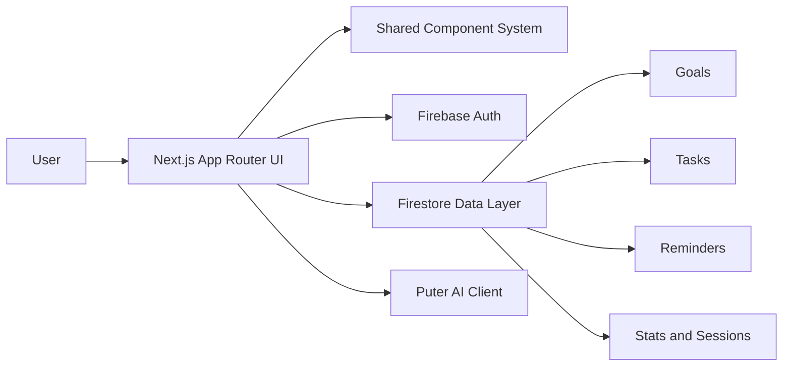

# StreakedIn

<p align="center">
  
</p>

<p align="center">
  <a href="https://nextjs.org/"></a>
  <a href="https://react.dev/"></a>
  <a href="https://www.typescriptlang.org/"></a>
  <a href="https://tailwindcss.com/"></a>
  <a href="https://firebase.google.com/"></a>
</p>

<p align="center">
  <a href="./LICENSE"></a>
  <a href="./CONTRIBUTING.md"></a>
  
</p>

StreakedIn is a professional productivity dashboard for planning goals, tracking tasks, managing reminders, and working with an AI assistant in one unified workspace.

## Why StreakedIn

- Structured goal planning with category-based progress tracking
- Fast task management with priority, due dates, and completion flow
- Reminders and timeline-oriented productivity habits
- AI-assisted goal/task generation and chat support
- Responsive dashboard designed for desktop and mobile
- Firebase-backed real-time data and authentication

## Product Preview

<p align="center">
  
</p>

## Feature Matrix

| Area | What you get |
| --- | --- |
| Dashboard | KPI cards, progress summaries, quick actions, and contextual insights |
| Goals | Create/edit goals, status tracking, progress bars, AI-generated goal suggestions |
| Tasks | Add/edit/delete tasks, filters, sorting, priorities, AI-generated tasks |
| Analytics | Goal/task completion analysis and productivity trend visibility |
| Reminders | Reminder configuration and notification controls |
| AI Assistant | Prompt-driven guidance, sessions, and productivity-focused chat workflows |
| Settings | Account preferences and app behavior controls |

## Architecture


```mermaid
flowchart LR
  U[User] --> UI[Next.js App Router UI]
  UI --> C[Shared Component System]
  UI --> A[Firebase Auth]
  UI --> D[Firestore Data Layer]
  UI --> P[Puter AI Client]
  D --> G[Goals]
  D --> T[Tasks]
  D --> R[Reminders]
  D --> S[Stats and Sessions]
```

## Tech Stack

- Next.js 16 (App Router)
- React 19 + TypeScript 5
- Tailwind CSS 4
- Firebase (Auth + Firestore + Analytics)
- Framer Motion + Lucide React

## Getting Started

### 1. Prerequisites

- Node.js 20+
- npm 10+
- A Firebase project (web app credentials)

### 2. Install dependencies

```bash
npm install
```

### 3. Configure environment variables

Create a `.env.local` file in the project root:

```env
NEXT_PUBLIC_FIREBASE_API_KEY=your_api_key
NEXT_PUBLIC_FIREBASE_AUTH_DOMAIN=your_project.firebaseapp.com
NEXT_PUBLIC_FIREBASE_PROJECT_ID=your_project_id
NEXT_PUBLIC_FIREBASE_STORAGE_BUCKET=your_project.appspot.com
NEXT_PUBLIC_FIREBASE_MESSAGING_SENDER_ID=your_sender_id
NEXT_PUBLIC_FIREBASE_APP_ID=your_app_id
NEXT_PUBLIC_FIREBASE_MEASUREMENT_ID=your_measurement_id
```

### 4. Run locally

```bash
npm run dev
```

Open `http://localhost:3000`.

## Available Scripts

| Script | Description |
| --- | --- |
| `npm run dev` | Start local dev server |
| `npm run build` | Create production build |
| `npm run start` | Run production build locally |
| `npm run lint` | Run ESLint checks |

## Project Structure

```text
src/
  app/                 # App Router pages (landing, login, dashboard)
  components/
    common/            # Shared design system primitives
    landing/           # Marketing/landing page UI
    login/             # Authentication page UI
    dashboard/         # Dashboard shell + feature tabs
  contexts/            # Auth and theme state providers
  lib/                 # Firebase setup + services layer
public/                # Static assets
```

## Contributing

Please read [CONTRIBUTING.md](./CONTRIBUTING.md) for setup, workflow, and pull request standards.

## License

This project is licensed under the MIT License. See [LICENSE](./LICENSE).
