```mermaid
graph LR
    A[🍴 Fork] --> B[🌿 Branch]
    B --> C[✏️ Code]
    C --> D[🧪 Test]
    D --> E[📤 PR]
    E --> F[👀 Review]
    F --> G[🎉 Merge]

    style A fill:#1a1a2e,stroke:#00d4ff,stroke-width:2px
    style G fill:#48bb78,stroke:#48bb78,stroke-width:2px
```

<div align="center">


<h3>
  
  Transform your productivity with intelligent goal tracking
  
</h3>

<p align="center">
  
  
  
  
</p>

<p align="center">
  
  
  
  
  
</p>

<p align="center">
  <a href="https://streakedin.vercel.app">
    
  </a>
  <a href="https://docs.streakedin.com">
    
  </a>
  <a href="https://github.com/Anish-2005/StreakedIn/issues">
    
  </a>
  <a href="https://github.com/Anish-2005/StreakedIn/issues">
    
  </a>
</p>

<br/>


</div>

<br/>

<br/>

##  Screenshots & Preview

<div align="center">

<table>
  <tr>
    <td align="center" width="50%">
      
      <h3>Desktop Dashboard</h3>
      
      <p><em>Full-featured dashboard with real-time analytics</em></p>
    </td>
    <td align="center" width="50%">
      
      <h3>Mobile Experience</h3>
      
      <p><em>Seamless mobile-responsive design</em></p>
    </td>
  </tr>
  <tr>
    <td align="center" colspan="2">
      
      <h3>Goal Tracking Interface</h3>
      
      <p><em>Intuitive goal management with visual progress indicators</em></p>
    </td>
  </tr>
</table>

</div>

<p align="center">
  
</p>

<br/>

##  Features That Make You Productive

<div align="center">

###  Core Functionality

<table>
  <tr>
    <th width="25%">Feature</th>
    <th width="50%">Description</th>
    <th width="25%">Status</th>
  </tr>
  <tr>
    <td align="center">
      <br/>
      <strong>Dashboard Analytics</strong>
    </td>
    <td>Real-time productivity metrics with beautiful visual insights and trend analysis</td>
    <td align="center">
      
    </td>
  </tr>
  <tr>
    <td align="center">
      <br/>
      <strong>Goal Management</strong>
    </td>
    <td>SMART goal setting with intelligent progress tracking and milestone celebrations</td>
    <td align="center">
      
    </td>
  </tr>
  <tr>
    <td align="center">
      <br/>
      <strong>Task Management</strong>
    </td>
    <td>Intelligent task scheduling with smart prioritization and time tracking</td>
    <td align="center">
      
    </td>
  </tr>
  <tr>
    <td align="center">
      <br/>
      <strong>AI Assistant</strong>
    </td>
    <td>AI-powered recommendations, insights, and personalized productivity tips</td>
    <td align="center">
      
    </td>
  </tr>
  <tr>
    <td align="center">
      <br/>
      <strong>Mobile Responsive</strong>
    </td>
    <td>Seamless experience across all devices with adaptive UI components</td>
    <td align="center">
      
    </td>
  </tr>
  <tr>
    <td align="center">
      <br/>
      <strong>Real-time Sync</strong>
    </td>
    <td>Firebase-powered instant data synchronization across all your devices</td>
    <td align="center">
      
    </td>
  </tr>
</table>

<br/>

###  Premium User Experience

</div>

<table align="center">
  <tr>
    <td align="center" width="33%">
      <br/>
      <h3>🌙 Dark Theme</h3>
      <p>Modern dark UI with stunning glassmorphism effects</p>
    </td>
    <td align="center" width="33%">
      <br/>
      <h3>📊 Interactive Charts</h3>
      <p>Beautiful animated data visualizations</p>
    </td>
    <td align="center" width="33%">
      <br/>
      <h3>🎭 Smooth Animations</h3>
      <p>Framer Motion powered transitions</p>
    </td>
  </tr>
  <tr>
    <td align="center" width="33%">
      <br/>
      <h3>♿ Accessibility</h3>
      <p>WCAG compliant inclusive design</p>
    </td>
    <td align="center" width="33%">
      <br/>
      <h3>⚡ Performance</h3>
      <p>Optimized for lightning-fast speed</p>
    </td>
    <td align="center" width="33%">
      <br/>
      <h3>🔐 Secure</h3>
      <p>Firebase authentication & encryption</p>
    </td>
  </tr>
</table>

<p align="center">
  
</p>

## 🏗️ Architecture

<div align="center">

### System Architecture


### Component Architecture


</div>

---

<br/>

##  Tech Stack

<div align="center">

<table>
  <tr>
    <td align="center" width="25%">
      
      <h3>Frontend Framework</h3>
    </td>
    <td width="75%">
      
      
      
    </td>
  </tr>
  <tr>
    <td align="center">
      
      <h3>Styling & UI</h3>
    </td>
    <td>
      
      
      
    </td>
  </tr>
  <tr>
    <td align="center">
      
      <h3>Backend & Database</h3>
    </td>
    <td>
      
      
      
    </td>
  </tr>
  <tr>
    <td align="center">
      
      <h3>Development Tools</h3>
    </td>
    <td>
      
      
      
    </td>
  </tr>
</table>

</div>

<p align="center">
  
</p>

<p align="center">
  
</p>

<br/>

##  Quick Start Guide

<div align="center">

###  Prerequisites

<table>
  <tr>
    <td align="center" width="33%">
      <br/>
      <strong>Node.js 18+</strong>
    </td>
    <td align="center" width="33%">
      <br/>
      <strong>npm or yarn</strong>
    </td>
    <td align="center" width="33%">
      <br/>
      <strong>Firebase Account</strong>
    </td>
  </tr>
</table>

</div>

<br/>

###  Installation Steps

<details open>
<summary><b>📥 Step 1: Clone the repository</b></summary>

```bash
git clone https://github.com/Anish-2005/StreakedIn.git
cd StreakedIn
```

</details>

<details open>
<summary><b>📦 Step 2: Install dependencies</b></summary>

```bash
npm install
# or
yarn install
# or
pnpm install
```

</details>

<details open>
<summary><b>⚙️ Step 3: Environment Setup</b></summary>

Create a `.env.local` file in the root directory:

```bash
cp .env.example .env.local
```

Add your Firebase credentials:

```env
NEXT_PUBLIC_FIREBASE_API_KEY=your_api_key_here
NEXT_PUBLIC_FIREBASE_AUTH_DOMAIN=your_auth_domain_here
NEXT_PUBLIC_FIREBASE_PROJECT_ID=your_project_id_here
NEXT_PUBLIC_FIREBASE_STORAGE_BUCKET=your_storage_bucket_here
NEXT_PUBLIC_FIREBASE_MESSAGING_SENDER_ID=your_sender_id_here
NEXT_PUBLIC_FIREBASE_APP_ID=your_app_id_here
```

</details>

<details open>
<summary><b>🚀 Step 4: Run the development server</b></summary>

```bash
npm run dev
# or
yarn dev
# or
pnpm dev
```

</details>

<details open>
<summary><b>🌐 Step 5: Open your browser</b></summary>

Navigate to:
```
http://localhost:3000
```

<p align="center">
  
</p>

</details>

<p align="center">
  
</p>

## 📖 Usage Guide

<div align="center">

### 🎯 Getting Started

1. **Create Account** - Sign up with email or Google OAuth
2. **Set Your Goals** - Define SMART goals with deadlines
3. **Track Progress** - Update tasks and monitor achievements
4. **Analyze Performance** - View detailed analytics and insights
5. **Get AI Recommendations** - Receive personalized productivity tips

### 📊 Dashboard Overview

| Section | Purpose | Key Features |
|---------|---------|--------------|
| **Overview** | Main dashboard with key metrics | Stats cards, recent goals, quick actions |
| **Goals & Targets** | Goal management interface | Create, edit, track progress, set reminders |
| **Task Manager** | Daily task organization | Priority setting, time tracking, completion status |
| **Analytics** | Performance insights | Charts, trends, productivity scores |
| **Reminders** | Notification system | Custom alerts, deadline tracking |
| **AI Assistant** | Intelligent recommendations | Goal suggestions, productivity tips |
| **Settings** | User preferences | Profile, notifications, data export |

</div>

---

## 🎨 Design System

<div align="center">

### Color Palette

| Color | Hex | Usage |
|-------|-----|-------|
| **Primary Blue** | `#00d4ff` | Buttons, links, accents |
| **Secondary Purple** | `#9f7aea` | Secondary actions, highlights |
| **Dark Background** | `#1a1a2e` | Main background |
| **Card Background** | `#16213e` | Component backgrounds |
| **Text Primary** | `#ffffff` | Primary text |
| **Text Secondary** | `#a0aec0` | Secondary text |

### Typography

- **Primary Font**: Inter (Sans-serif)
- **Headings**: 600-700 weight, responsive sizing
- **Body Text**: 400 weight, optimized for readability
- **Accent Text**: Gradient text effects

### Component Library

```typescript
// Example usage of common components
import { Button, Card, StatsCard, ProgressBar } from '@/components/common';

// Primary button with animation
<Button variant="primary" size="lg" icon={<Plus />}>
  Create New Goal
</Button>

// Statistics card
<StatsCard
  title="Productivity Score"
  value="87%"
  change="+5%"
  icon={<TrendingUp />}
  color="text-green-400"
/>

// Progress visualization
<ProgressBar value={75} className="w-full" />
```

</div>

---

## 🔧 API Reference

<div align="center">

### Firebase Collections

```javascript
// User Profile
{
  uid: "user_id",
  email: "user@example.com",
  displayName: "John Doe",
  plan: "Professional Plan",
  role: "User",
  createdAt: "2024-01-01T00:00:00Z"
}

// Goals Collection
{
  id: "goal_id",
  userId: "user_id",
  title: "Complete React Certification",
  description: "Master React development",
  progress: 75,
  deadline: "2024-02-15",
  category: "Learning",
  aiSuggested: true,
  createdAt: "2024-01-01T00:00:00Z"
}

// Tasks Collection
{
  id: "task_id",
  goalId: "goal_id",
  title: "Study React Hooks",
  completed: false,
  priority: "high",
  dueDate: "2024-01-15",
  createdAt: "2024-01-01T00:00:00Z"
}
```

### Authentication Flow


</div>

---

<br/>

##  Contributing

<div align="center">

 **We love your input!** We want to make contributing as easy and transparent as possible.

<br/><br/>

###  Development Workflow



<br/>

###  How to Contribute

</div>

<table>
  <tr>
    <td width="10%" align="center">
      <br/>
      <strong>Step 1</strong>
    </td>
    <td width="90%">
      <strong>Fork the repository</strong><br/>
      Click the fork button at the top right
    </td>
  </tr>
  <tr>
    <td align="center">
      <br/>
      <strong>Step 2</strong>
    </td>
    <td>
      <strong>Create your feature branch</strong><br/>
      <code>git checkout -b feature/AmazingFeature</code>
    </td>
  </tr>
  <tr>
    <td align="center">
      <br/>
      <strong>Step 3</strong>
    </td>
    <td>
      <strong>Commit your changes</strong><br/>
      <code>git commit -m 'Add some AmazingFeature'</code>
    </td>
  </tr>
  <tr>
    <td align="center">
      <br/>
      <strong>Step 4</strong>
    </td>
    <td>
      <strong>Push to the branch</strong><br/>
      <code>git push origin feature/AmazingFeature</code>
    </td>
  </tr>
  <tr>
    <td align="center">
      <br/>
      <strong>Step 5</strong>
    </td>
    <td>
      <strong>Open a Pull Request</strong><br/>
      Submit your PR with a clear description
    </td>
  </tr>
</table>

<br/>

<div align="center">

###  Code Standards

</div>

<p align="center">
  
  
  
  
</p>

<table align="center">
  <tr>
    <td align="center">✅</td>
    <td><strong>TypeScript</strong> for type safety</td>
  </tr>
  <tr>
    <td align="center">✅</td>
    <td><strong>ESLint</strong> + <strong>Prettier</strong> for code formatting</td>
  </tr>
  <tr>
    <td align="center">✅</td>
    <td><strong>Conventional Commits</strong> for commit messages</td>
  </tr>
  <tr>
    <td align="center">✅</td>
    <td><strong>Component composition</strong> over inheritance</td>
  </tr>
  <tr>
    <td align="center">✅</td>
    <td><strong>Responsive design</strong> first approach</td>
  </tr>
</table>

<p align="center">
  
</p>

<br/>

##  Roadmap

<div align="center">

<table>
  <tr>
    <th width="15%">Phase</th>
    <th width="25%">Title</th>
    <th width="50%">Features</th>
    <th width="10%">Status</th>
  </tr>
  <tr>
    <td align="center">
      <br/>
      <strong>Phase 1</strong>
    </td>
    <td>
      <strong>Core Features</strong>
    </td>
    <td>
      ✅ User authentication & profiles<br/>
      ✅ Goal setting & tracking<br/>
      ✅ Task management<br/>
      ✅ Basic analytics<br/>
      ✅ Mobile responsiveness
    </td>
    <td align="center">
      
    </td>
  </tr>
  <tr>
    <td align="center">
      <br/>
      <strong>Phase 2</strong>
    </td>
    <td>
      <strong>Advanced Features</strong>
    </td>
    <td>
      🚧 Team collaboration features<br/>
      🚧 Advanced AI insights<br/>
      🚧 Calendar app integration<br/>
      🚧 Export functionality<br/>
      🚧 Offline mode support
    </td>
    <td align="center">
      
    </td>
  </tr>
  <tr>
    <td align="center">
      <br/>
      <strong>Phase 3</strong>
    </td>
    <td>
      <strong>Enterprise Features</strong>
    </td>
    <td>
      📋 Multi-organization support<br/>
      📋 Advanced reporting dashboard<br/>
      📋 RESTful API for integrations<br/>
      📋 White-label solutions<br/>
      📋 Advanced security features
    </td>
    <td align="center">
      
    </td>
  </tr>
</table>

<br/>

<p align="center">
  
  <strong>Want to influence our roadmap?</strong>
  
</p>

<p align="center">
  <a href="https://github.com/Anish-2005/StreakedIn/issues">
    
  </a>
  <a href="https://github.com/Anish-2005/StreakedIn/discussions">
    
  </a>
</p>

</div>

<p align="center">
  
</p>

<br/>

##  License

<div align="center">


<h3>MIT License</h3>

**StreakedIn** is open source software

<br/>


<br/><br/>

<details>
<summary><b>📜 View Full License</b></summary>

<br/>

```
MIT License

Copyright (c) 2024 Anish-2005

Permission is hereby granted, free of charge, to any person obtaining a copy
of this software and associated documentation files (the "Software"), to deal
in the Software without restriction, including without limitation the rights
to use, copy, modify, merge, publish, distribute, sublicense, and/or sell
copies of the Software, and to permit persons to whom the Software is
furnished to do so, subject to the following conditions:

The above copyright notice and this permission notice shall be included in all
copies or substantial portions of the Software.

THE SOFTWARE IS PROVIDED "AS IS", WITHOUT WARRANTY OF ANY KIND, EXPRESS OR
IMPLIED, INCLUDING BUT NOT LIMITED TO THE WARRANTIES OF MERCHANTABILITY,
FITNESS FOR A PARTICULAR PURPOSE AND NONINFRINGEMENT. IN NO EVENT SHALL THE
AUTHORS OR COPYRIGHT HOLDERS BE LIABLE FOR ANY CLAIM, DAMAGES OR OTHER
LIABILITY, WHETHER IN AN ACTION OF CONTRACT, TORT OR OTHERWISE, ARISING FROM,
OUT OF OR IN CONNECTION WITH THE SOFTWARE OR THE USE OR OTHER DEALINGS IN THE
SOFTWARE.
```

</details>

</div>

<p align="center">
  
</p>

<br/>

##  Acknowledgments

<div align="center">

 **Built with love using modern web technologies** 

<br/><br/>

###  Special Thanks

<table>
  <tr>
    <td align="center" width="20%">
      <br/>
      <strong>Next.js Team</strong><br/>
      <sub>Amazing framework</sub>
    </td>
    <td align="center" width="20%">
      <br/>
      <strong>Tailwind CSS</strong><br/>
      <sub>Utility-first styling</sub>
    </td>
    <td align="center" width="20%">
      <br/>
      <strong>Framer Motion</strong><br/>
      <sub>Smooth animations</sub>
    </td>
    <td align="center" width="20%">
      <br/>
      <strong>Firebase</strong><br/>
      <sub>Backend services</sub>
    </td>
    <td align="center" width="20%">
      <br/>
      <strong>Lucide</strong><br/>
      <sub>Beautiful icons</sub>
    </td>
  </tr>
</table>

<br/>

###  Contributors

<a href="https://github.com/Anish-2005/StreakedIn/graphs/contributors">
  
</a>

<br/><br/>


<br/><br/>

###  Show Your Support

<p align="center">
  <strong>If you found this project helpful, please consider:</strong>
</p>

<p align="center">
  <a href="https://github.com/Anish-2005/StreakedIn">
    
  </a>
  <a href="https://github.com/Anish-2005/StreakedIn/fork">
    
  </a>
  <a href="https://github.com/Anish-2005/StreakedIn/issues">
    
  </a>
</p>

<br/>

---

<br/>

<h3>
  
  Made with 
  
  by <a href="https://github.com/Anish-2005">Anish-2005</a>
  
</h3>

<br/>

<p align="center">
  <a href="#-features-that-make-you-productive">
    
  </a>
</p>

<br/>


<br/>

<p align="center">
  
</p>

</div>